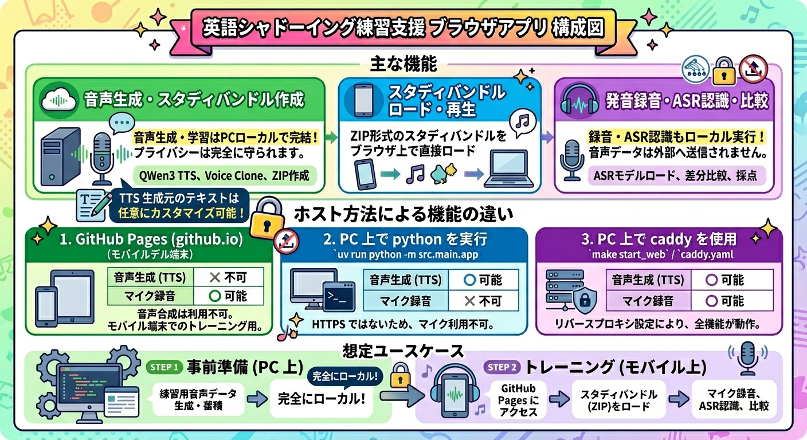

# study-lang Web UI

英語シャドーイング練習を支援するブラウザアプリです。  

---

## 主な機能

本アプリケーションには、主に以下の機能があります。

- **QWen3 TTS を使った練習用音声データの生成**: 参照音声を指定（WAVファイルのアップロード）し、Voice Clone（クローン TTS）技術を用いて好みのフレーズで練習用音声データを作成します。
- **作成済みの練習用音声データのロード**: 生成・エクスポートされた練習用音声データ（ZIP形式のスタディバンドル）をロードし、トレーニングを開始します。
- **ASR 用モデルデータのダウンロードとアーカイブ化**: ブラウザ内で動作する OSS 音声認識（ASR）用モデルデータを ZIP としてダウンロードし、ローカル環境に保存します。
- **アーカイブした ASR 用モデルデータのロード**: IndexedDB またはローカルURLから、アーカイブ済みの ASR モデルデータをブラウザ上に直接ロードして使用します。
- **発音の録音・ASR 認識・比較**: マイクを使って自分の発音を録音し、ブラウザ内で ASR 認識を行い、お手本の練習用データとテキストの差分比較（採点）を行います。
- **ワンタップ練習開始（Start Practice）**: 録音開始とお手本音声再生を同時に行う「Start Practice」ボタンにより、手順を簡略化した快適なシャドーイング体験を実現します。
- **VAD（音声区間検出）によるトリミング**: 録音後、無音区間を自動検出してトリミングし、ASR 精度を向上させます。トリミング前・後の音声を個別に再生して確認でき、検出区間をカラーバーで可視化します。
- **マイク・スピーカー設定の個別指定**: 複数の音声入力・出力デバイスが存在する場合に、マイクとスピーカーを個別に選択・固定できます（折り畳み式パネル）。



---

## ホスト方法による動作可能な機能の違い

本アプリは、ホスト方法（稼働環境）によって利用可能な機能が異なります。

| ホスト方法 / 環境 | 練習用音声データ生成（TTS） | マイクによる録音・ASR | 備考 |
|---|:---:|:---:|---|
| **GitHub Pages**<br>([github.io](https://ifritjp.github.io/study_lang/shadowing_webui/src/mobile/)) | ❌ 不可 | ◯ 可能 | バックエンドが必要な TTS 音声合成が利用できません |
| **PC 上で python を実行**<br>(`uv run python -m src.main.app`) | ◯ 可能 | ❌ 不可 | HTTPS/localhost ではないため、ブラウザセキュリティの制約によりマイク（getUserMedia）が使用できません |
| **PC 上で caddy を使用**<br>(`make start_web` / `caddy.yaml`) | ◯ 可能 | ◯ 可能 | リバースプロキシと適切なホスト名/SSL設定等により、すべての機能が動作します |

### 想定ユースケース

上記の制約から、本アプリでは以下のステップでトレーニングを行うことを想定しています。

1. **事前準備 (PC上)**:
   - PC上で Python API サーバーを動かして「Option B: Generate study bundle via TTS」等を用いて練習用音声データを生成・蓄積します。
   - 蓄積したデータからスタディバンドル（ZIPファイル）を作成し、ローカル（またはモバイル端末に転送可能にする場所）にダウンロードして保存します。
2. **トレーニング (モバイルデバイス上)**:
   - モバイル端末から [GitHub Pages (github.io)](https://ifritjp.github.io/study_lang/shadowing_webui/src/mobile/) にアクセスします。
   - 保存しておいたスタディバンドル ZIP をアップロードしてロードします。
   - モバイル端末のマイクを使って発音の録音、ローカル ASR 認識、およびお手本データとのテキスト比較によるトレーニングを行います。

---

## 機能一覧

| 機能 | 説明 |
|------|------|
| **スタディバンドル アップロード** | PC ワークフローで生成した ZIP をブラウザに読み込む |
| **TTS 音声生成（単発）** | 学年・フレーズを選び、参照音声を使ってクローン TTS で音声を生成する |
| **TTS 音声生成（一括）** | 選択した学年の全フレーズを一括で生成してバンドルにまとめる |
| **バンドル生成** | 生成済み音声リストを 1 つの ZIP にまとめてブラウザに読み込む |
| **ASR エンジン切替** | ブラウザ内蔵 SpeechRecognition と OSS ローカルモデルを切り替える |
| **OSS モデル読み込み** | WASM/ONNX モデル ZIP をアップロードまたは URL 指定で読み込む |
| **音声再生** | クローン音声を参照としてブラウザ上で再生する |
| **ワンタップ練習開始** | 「Start Practice」ボタン 1 つで録音開始とお手本音声再生を同時に実行する |
| **録音 / 停止** | マイクを使って自分の音声を録音する |
| **VAD トリミング** | 録音後に無音区間を自動検出してトリミングし、ASR 精度を向上させる |
| **VAD バー表示** | 音声区間の検出結果をカラーバーで可視化する（青=音声あり、グレー=無音） |
| **オリジナル・トリミング音声再生** | VAD 処理前後の音声を個別に再生して聴き比べられる |
| **マイク選択** | 複数のマイクデバイスから録音に使用するものを選択する（折り畳みパネル） |
| **スピーカー選択** | 複数のスピーカーデバイスから再生に使用するものを選択する（折り畳みパネル） |
| **文字起こし（ASR）** | 録音した音声を ASR でテキスト化する（自動実行オプションあり） |
| **テキスト差分比較** | ASR 結果と正解テキストを単語単位で比較・ハイライト表示する |
| **スコア表示** | 単語一致率をパーセンテージで表示する |
| **ストレージ管理** | IndexedDB に保存した各種データを個別に確認・削除できる |

---

## システム構成

```
[ブラウザ（モバイル/PC）]
  ├── src/mobile/index.html  ← Web UI のエントリポイント
  ├── src/mobile/app.js      ← フロントエンドロジック
  └── src/mobile/styles.css  ← スタイル

[Python API サーバー]
  └── src/main/app.py        ← 静的ファイル配信 + TTS API
        └── POST /api/generate-bundle  ← TTS 音声生成エンドポイント
```

- フロントエンドは **IndexedDB** にスタディバンドル・ASR モデル・参照音声を永続保存します。
- バックエンドは **Qwen3-TTS** を使ったボイスクローン TTS を提供します（要 GPU 環境）。

---

## セットアップ

### 必要環境

- Python 3.11+
- [uv](https://github.com/astral-sh/uv)
- GPU 環境（TTS 生成時。VRAM 16GB 以上推奨）

### インストール

```bash
git clone git@github.com:ifritJP/shadowing_webui.git
cd shadowing_webui
uv sync
```

---

## サーバーの起動

```bash
uv run python -m src.main.app -p 8080
```

| オプション | 省略時デフォルト | 説明 |
|-----------|----------------|------|
| `-p`, `--port` | `8000` | 待ち受けポート番号 |

起動後、ブラウザで `http://localhost:8080` にアクセスすると Web UI が開きます（`/src/mobile/index.html` に自動リダイレクトされます）。

---

## 使い方

### ステップ 1：スタディバンドルを用意する

スタディバンドルは「フレーズテキスト + クローン音声」を ZIP にまとめたファイルです。  
※ **初回起動時** は読み込むための ZIP ファイルが存在しないため、まず **Option B** を実行して音声データを作成してください。

#### Option A：既存の ZIP をアップロードする（2回目以降）

1. **「Option A: Upload study bundle ZIP」** から作成済みのスタディバンドル ZIP を選択してアップロードします。
2. 読み込みが完了するとフレーズが自動でセットされます。

#### Option B：TTS でその場生成する（初回はこちら）

> ※本機能は、バックエンドサーバー（Python API）が起動している必要があります。

1. **「Grade Level」** から学年を選択し、**「Select Phrase」** から練習したいフレーズを選びます（テキストエリアに自動入力されます）。
2. **「Reference audio for voice cloning」** からお好みの参照音声（WAV または MP3）を選択します（省略するとデフォルト音声が使用されます）。
   > [!WARNING]
   > **【重要・法的注意】**
   > ボイスクローンに使用する参照音声は、著作権や利用規約、他者の声のクローンに伴う法的問題（パブリシティ権、肖像権等）に違反しないよう、必ず事前に権利状況を十分に確認した上で自己責任で使用してください。
3. **「Generate & Add to List」** ボタンを押すと、音声データが生成されてリストに追加されます。
   - 選択した学年の全フレーズを一括で生成したい場合は、**「Generate All for Selected Grade」** を押します。
4. フレーズ生成後、**「Create & Load Study Bundle」** ボタンを押すと、生成したすべての音声が 1 つの ZIP にまとめられ、ローカルにダウンロードされるとともに、ブラウザに自動で読み込まれます。

---

### ステップ 2：ASR（音声認識）モデルを準備する

自分の発音を認識するための ASR モデルを準備します。2 通りの方法があります。

#### 方法 1：Hugging Face から直接ダウンロードする（推奨・簡単）

1. **「Model Source」** ドロップダウンで **「Hugging Face Hub (Direct download in browser)」** を選択します。
2. **「Choose Whisper Model」** からモデル（推奨: `onnx-community/whisper-base (Recommended)`）を選択し、**「Download & Load」** を押します。自動的にブラウザ内にモデルがダウンロードされ、読み込まれます。
3. ロード完了後、**「Save Loaded Model as ZIP」** ボタンを押すと、ダウンロードされたモデルを ZIP として手元に保存できます（オフライン環境へのバックアップ用）。

#### 方法 2：事前に作成したローカルのモデル ZIP を読み込む

1. **「Model Source」** ドロップダウンで **「Local Model Bundle (ZIP / Local URL)」** を選択します。
2. **「OSS model bundle」** から手持ちのモデル ZIP をアップロードするか、または URL 入力欄にパスを指定して **「Fetch & Load」** を押します。
3. **「Load OSS model」** ボタンを押して読み込みます。

---

### ステップ 3：バンドルを確認する

バンドルが読み込まれると **「3. Review bundle」** カードが表示されます。

- **フレーズ切替**: `Switch Phrase in Bundle` ドロップダウンで複数フレーズを切り替えられます。
- **参照音声再生**: `<audio>` プレイヤーでクローン音声を再生できます。
- **参照音声の ASR**: **「ASR uploaded sample audio」** ボタンで参照音声を文字起こしできます。

---

### ステップ 4：録音して文字起こしする

#### マイク・スピーカーの設定（必要な場合）

「🎙️ Mic / Speaker Settings」をタップすると、マイクとスピーカーのプルダウンが展開されます（デフォルトは折り畳み状態）。  
複数のデバイスが接続されている場合は、使用したいマイクとスピーカーをここで選択してください。選択した設定は `localStorage` に保存されます。

#### 練習の開始（推奨）

- **「Start Practice (Record & Play)」** ボタンを押すと、録音開始とお手本音声の再生が同時に実行されます。

#### または個別操作

1. **「Start recording」** を押してマイクで発音を録音します。
2. **「Stop」** で録音を停止します。
3. **「Transcribe」** で ASR を実行します。

#### 録音停止後の自動処理

録音停止後、VAD（音声区間検出）により無音区間が自動でトリミングされます。  
処理完了後、以下が表示されます：

| 表示要素 | 内容 |
|---------|------|
| **Original Recording** | VAD 処理前のオリジナル録音を再生するプレイヤー |
| **Trimmed Audio (VAD applied)** | 無音区間を除去したトリミング後の録音を再生するプレイヤー |
| **VAD Segmentation バー** | 音声あり区間（青）と無音区間（グレー）をカラーバーで可視化 |

**自動化オプション：**

| チェックボックス | 動作 |
|----------------|------|
| 録音停止後、自動で ASR を実行する | Stop を押すと自動で Transcribe が走る |
| ASR 実行後、自動で比較する | 文字起こし完了後に自動でテキスト比較が走る |

---

### ステップ 5：結果を確認する

- **Transcript**: ASR の文字起こし結果が表示されます。
- **Compare Texts (Show Diff)**: 正解テキストと ASR 結果を単語単位で差分表示します。
  - 緑: ASR 結果のうち一致した単語
  - 赤: 誤認識または挿入された単語
  - 赤（取り消し線）: 読み飛ばした単語
- **Word overlap**: 単語一致率（%）が表示されます。
- **実行時情報**: エンジン・バックエンド・各処理時間が表示されます。

---

### ストレージ管理

ブラウザの IndexedDB に保存されたデータを確認・管理できます。

- **ダウンロード**: ストレージ一覧の各項目の右側にある緑色の **「Download」** ボタンを押すことで、IndexedDBに永続化されている個別アセットデータ（スタディバンドル ZIP、モデルバンドル ZIP、TTS生成用参照音声など）をローカルPC等のストレージへ直接ダウンロードできます。
- **個別削除**: ストレージ一覧の各項目の赤色の **「Delete」** ボタンで、アセットごとに個別にデータを削除できます。
  - Study Bundle
  - Model Bundle（ASR モデルの ZIP アーカイブ）
  - Reference Audio（TTS生成用参照音声）
- **全削除**: **「Clear browser storage」** ボタンで IndexedDB の全キャッシュデータを削除し、初期状態にリセットします。

---

## 開発者向け情報

### IPython モデルキャッシュ（開発用）

Qwen 系モデルのロードを毎回やり直さないように、開発用 IPython シェルを用意しています。

```bash
# 開発用依存のセットアップ（初回のみ）
uv sync --group dev

# 起動
uv run --group dev ipython -i src/main/dev_shell.py
# または
IPYTHONDIR=$PWD/.ipython uv run --group dev ipython
```

起動後に使えるヘルパー:

```python
get_asr_model("Qwen/Qwen3-ASR-4B", device_map="cuda:0")
get_tts_model("Qwen/Qwen3-TTS-4B", device_map="cuda:0")
list_cached_models()
clear_model_cache()
```

詳細は [docs/mobile-browser-workflow.md](docs/mobile-browser-workflow.md) を参照してください。

### ソース配置

```
src/
├── main/          # Python バックエンド（TTS API サーバー）
└── mobile/        # ブラウザ Web UI
    ├── index.html
    ├── app.js
    ├── styles.css
    └── ort-webgpu-diagnostic.html  # ONNX Runtime WebGPU 確認用
```

---

## ライセンス

MIT License — 詳細は [LICENSE](LICENSE) を参照してください。
