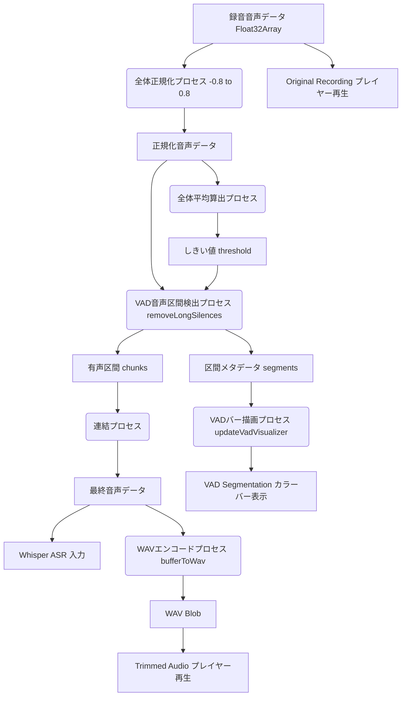

# VAD (Voice Activity Detection) アーキテクチャ設計書

本ドキュメントは、シャドーイング音声の無音区間（1秒以上）を動的に切り取るための簡易 VAD（音声区間検出）のデータフローおよびアルゴリズムについて記述します。

## 1. データフロー図 (DFD)

## 2. プロセス詳細

### 全体正規化プロセス
録音された Float32Array の音声データについて、最大絶対値振幅 `maxVal` を算出し、全体の振幅が `[-0.8, 0.8]` に収まるようにスケーリングします。

### 全体平均算出プロセス
正規化された音声データの絶対値平均 `meanVal` を計算します。この値の 1/3 (`meanVal / 3`) をベースのしきい値 `threshold` とします。

### VAD音声区間検出プロセス (removeLongSilences)
本プロセスにて、冒頭の無音部分・途中の長い沈黙区間・末尾の無音を一括して検出し、有声区間のみを抽出します。
1. **フレーム分割**: 音声を 20ms (16kHzサンプリングで 320サンプル) のフレームに分割し、フレーム内の絶対値平均（エネルギー）を算出します。
2. **有声フレーム判定**: フレームエネルギーが `threshold` (下限ガード 0.015 を適用) 以上であれば有声、未満であれば無音とフラグ付けします。
3. **ハングオーバー判定 (状態遷移)**:
   - **無音から有声への遷移**: 有声フラグが連続して 5フレーム (100ms) 以上検出されたら有声区間の開始とみなします。これによって、冒頭の無音や細かなノイズを飛ばし、本当の発声開始を検出します。
   - **有声から無音への遷移**: 無音フラグが連続して 50フレーム (1.0秒) 以上検出されたら有声区間の終了とみなします（1.0秒のハングオーバータイム）。これにより、会話の短い息継ぎでは途切れず、1秒以上の本格的な沈黙のみをトリミング対象とします。
4. **マージン付与と切り出し**: 検出された各有声区間の前後に 0.1秒 の安全マージンを付与して部分配列を抽出します。
5. **メタデータ付与**: 算出された有声区間 (segments) や総フレーム数を、返却される Float32Array オブジェクトのプロパティとして付加します。

### 連結プロセス
切り出された有声区間の部分配列（chunks）を一つの Float32Array にマージし、キャッシュ（`lastActiveTrimmedAudio`）へ保存および ASR 処理へと入力します。

### WAVエンコードプロセス (bufferToWav)
VAD 適用後の Float32Array データを WAV 形式の Blob (16kHz, モノラル, 16bit PCM) に変換し、`trimmed-recorded-audio` プレイヤーのソースに設定します。

### VADバー描画プロセス (updateVadVisualizer)
VAD処理から取得した `segments`（有声区間の開始・終了フレーム）と全体の総フレーム数の比率（%）を計算し、CSS `linear-gradient` の色分け（青＝キープ、グレー＝除去）を動的に生成して `#vad-bar` の背景に適用することで、トリミングされた位置を視覚化します。
